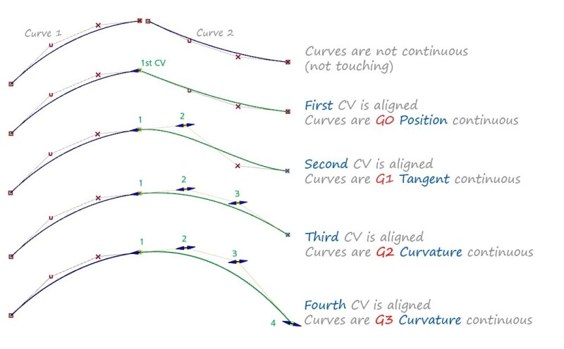

## Computer Graphics
### Review
- first the content
	* **shape**: surface from a real object
	* scene
	* color
	* movement
	* collision

- next, the render
	* simulation of light
	* materials
	* acceleration structures
	* render effects
	* anti-aliasing
	* virtual reality

### Shape
#### Techniques of discretization
- __point cloud__ is a common used way of storing the representation of a __scanned__ object
	* two technologies here: scanner and cloud point
	* them combined give us what we need when talking about shape: __discretization__

- this bring a few problems like 
	* blind spots of the scanner
	* the every same problem with discretization.. something contiguous in a discrete representation

#### LOD - Level Of Details
- every discretization uses a given LOD, which gives more or less points on the discrete model
	* more points is better, but heavier for processing
	* less points equals quick processing, but poor images

- different LODs for different area are an smart idea
	* plane places doesn't a lot of points to be represented

#### Sampling
- we call it sample a point of given model of function
	* sample: [x,y,z]

- the sample is stored the always the same way, doesn't matter how we got it
	* scanner or given math function

##### Function discretization - Cubic Bézier Curve

- we want to do a discretization a cubic Bézier curve
	* we could have the function first
	* or we could just adjust manually some points in a "curve shape"

- obviously there are many curves we could use as a study case,
	* ..but this one is pretty great
	* ..also the man who created this function need for a "car design" thing apparently he.. 
		+ "..used to draw many car shapes point-by-point, we every time he needed
		redo something he had a lot of re-work, now he just adjusts the firt and last point
		and voilá, the others adjust themselves"

- how it works
	* it's a math function in _b(t) = ..._ (some bizarre equation)
	* this equation takes as input 4 points (bc we're talking about the cubic version)
	* is respect of those point we manipulate _t_ so we get as many samples of _b(t)_ as we want
	* the sample will come close to _p0..p3_ as the t goes from _0..1_
	* when _0 < t < 1_ the sample point will be a combination of the 4 points
	* when _t = 0_ the sample point will be _p0_
	* when _t = 1_ the sample point will be _p1_

- the use of different control points will shape the curve
	* the use a box shaped point will give a nice inverted __u__ shaped curve
		+ you can see this by manipulating the points and _t_ in _https://www.desmos.com/calculator/cahqdxeshd_

- a terrible, **terrible** exemplification of that
```
0 <= t < =1
p1                p2


        ....
       .    .
      .      .
     .        .
    .          .
   .            .
  .              .
 .                .
p0                p4
```

- interpolation and approximation are used to create those kind of curves

- by __approximation__ we mean the decimal representation of a given number (like pi = 3.14)
- by __interpolation__ we mean the intermediate points for a set of given values of a dependent variable

### Homework
- see how to connect two curves and what is G0, G1, G2 continuity

- in a Bézier curve the 
	* _t = 0_ give us the _p0_
	* _t = 1_ give us the _p1_
	* _t = 0.5_ give us a point between _p0_ and _p1_
	* Q: what does _t = 0.25_ give us?
	* Given that is non-linear curve, walking a equal step (i.e. 0.1) won't walk at a constant speed.
	* Q: how to walk at a constant speed?

- see other curves

### Surface continuity
- check out _https://technologyinarchitecture.com/surface-continuity/_

- this is the name given to how to connect surfaces in CG 
	* G0: _sharp edges_, applies to all touching surfaces that need to represent a solid
	* G1: _engineering fillets_, used for low details (programs like CAD system)
	* G2: _curvate blends with 'lead-in'_, loose the highlight-kick of a tangent blend
	* G3: _class A quality blends_, even more 'lead-in', creating a 'seamless' blend between surfaces


